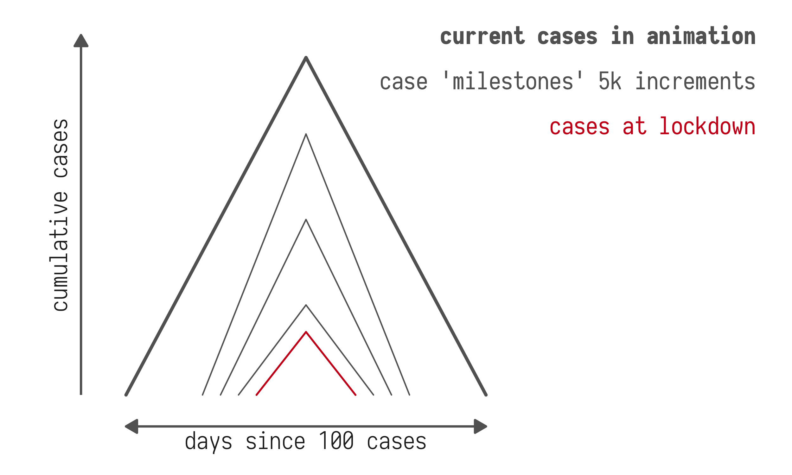
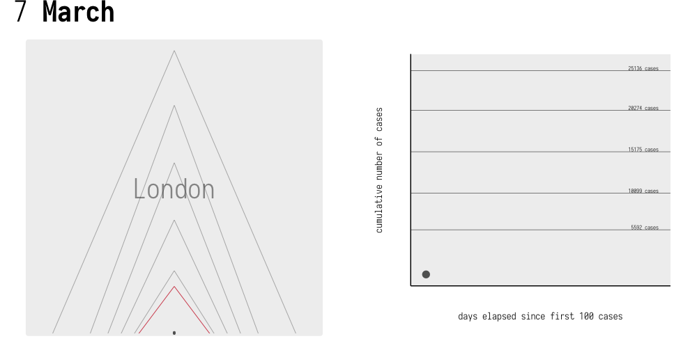
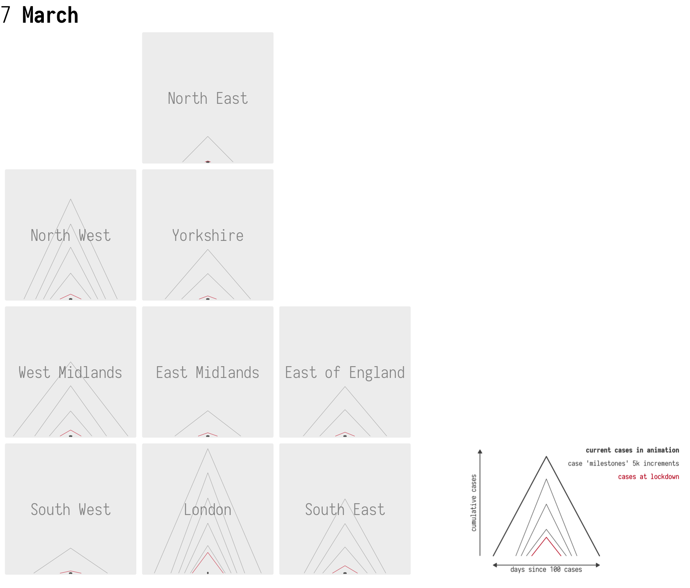
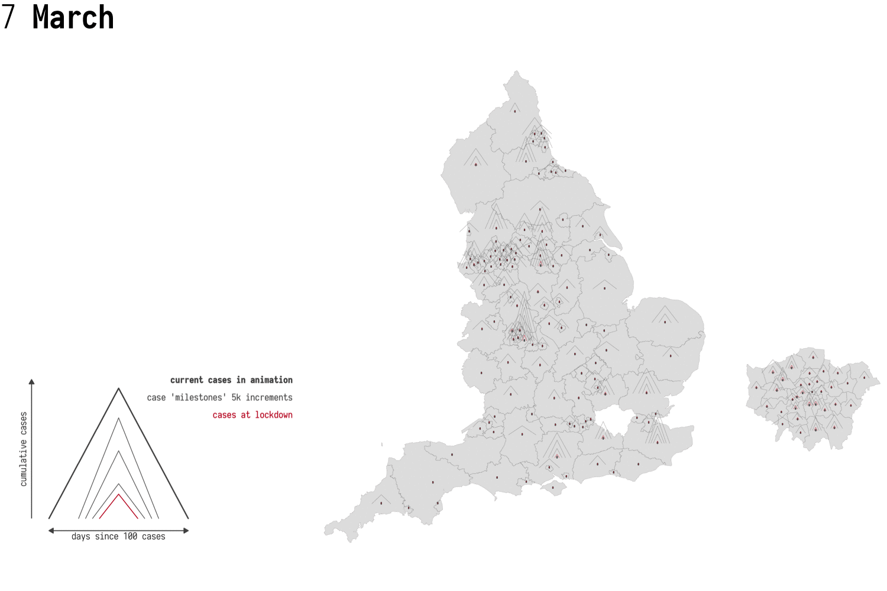

## Motivation

The release of area-level Covid-19 cases and deaths data raises a familiar challenge for spatial analysis -- how to compare change-over-time of cases aggregated to area-level, whilst retaining the spatial context associated with those areas? Some nice analysis and discussion of challenges via [this twitter thread](https://twitter.com/VictimOfMaths/status/1257428286566776833).    

## Visualization challenges/requirements

Many excellent recent examples have made heavy use of animation -- and this works well at communicating a sense of the pace of change and spread of cases across geographic areas. Animation is problematic, though, as it relies on visual memory. There may also be visualization design solutions that help with this -- to communicate simultaneously:

1. absolute number of cases
2. pace of change/spread
3. full geographic context

## Visualization re-designs : quick ideas in preparation 

Here's a first stab at a re-design that might meet these three 'design constraints'. Each Local Authority is represented as a triangle, with height varying according to absolute number of cases and width according to time (in days) since some threshold point -- say the first 100 cases at that Local Authority. As well as animating through cases, we annotate with key reference points or milestones -- say every 5,000 cases? These can be read a little like gradient contours on a relief map: reference triangles closer together suggest an accelerating pace of change in cases; those further apart show a decelerating pace of change. And this feature is sort of double-encoded via the animation itself. 

Here's an example applied to the London region, with standard line chart of cumulative cases for reference.

And applied to all regions -- approximately spatially arranged.

And applied to all LAs -- exactly geographically-arranged. Occlusion and clutter is a problem here of course -- and it might be worth trying this with ellipses rather than triangles. But it's worth exploring attempts to show both absolute numbers and pace of change within full geographic context. 

