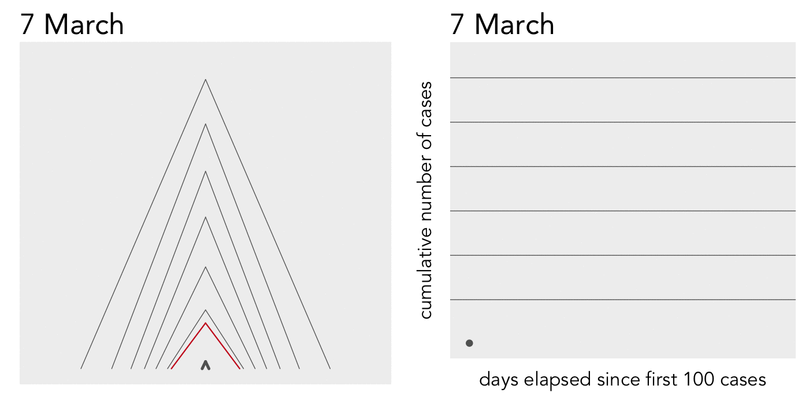
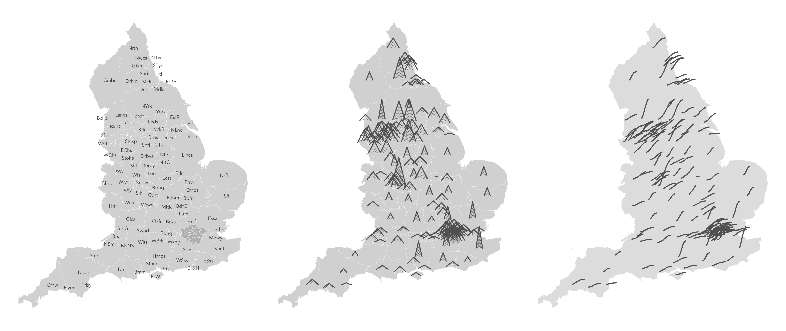
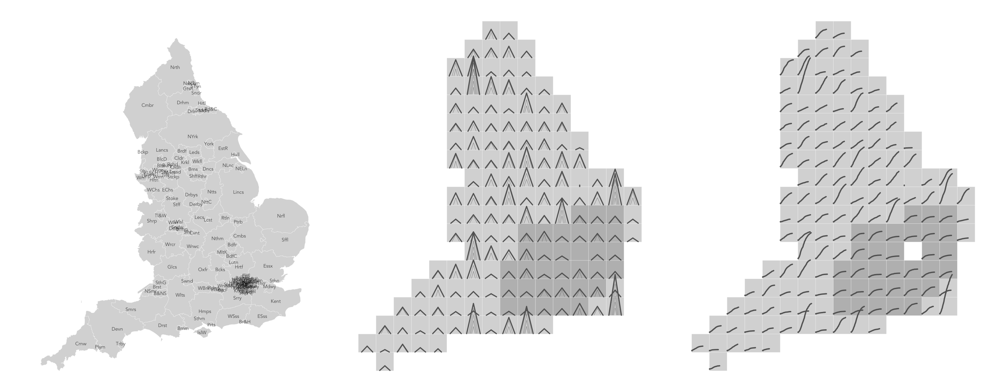
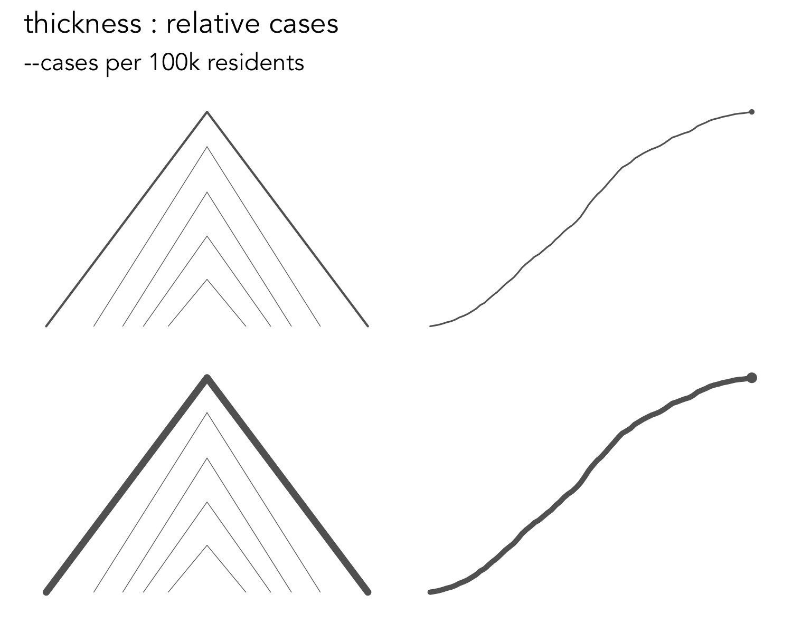
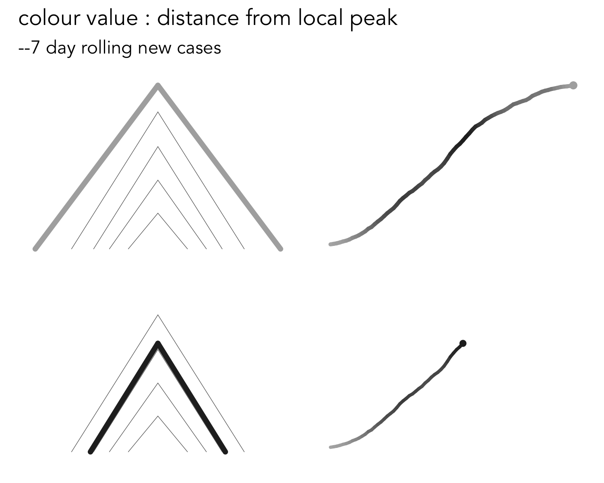
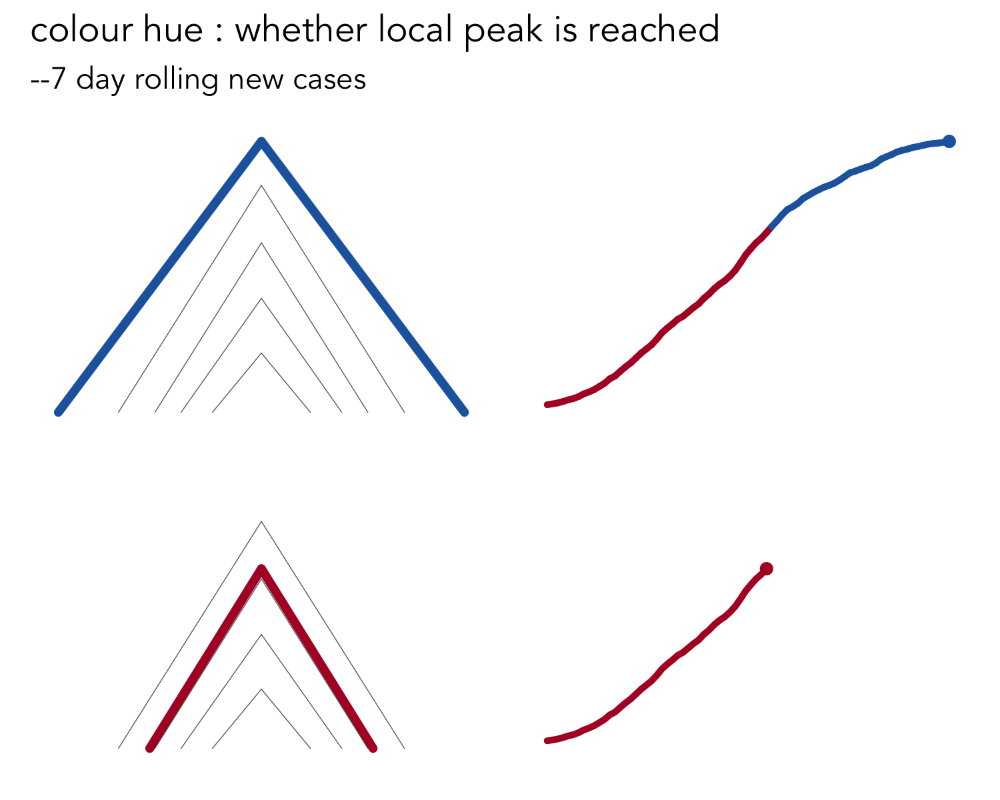
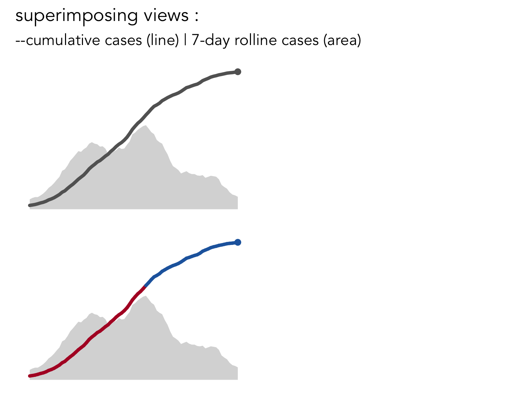

---
output:
   github_document
---
## Motivation

The release of area-level Covid-19 cases and deaths data raises a familiar challenge for spatial analysis: how to compare change-over-time of cases aggregated to area-level, whilst retaining the spatial context associated with those areas?

Animated choropleth maps have been deployed [with great effect](https://twitter.com/VictimOfMaths/status/1257428286566776833) to communicate a sense of the pace of change and spread of cases across geographic areas. Animation nevertheless relies on visual memory and it may also be desirable to encode several properties associated with case numbers simultaneously. Mathieu Rajerison demonstrated how [_geosparklines_](https://datagistips.hypotheses.org/514), or as proposed in [Wickham 2012](https://onlinelibrary.wiley.com/doi/abs/10.1002/env.2152), _glyphmaps_, can be used to characterise  exponential growth in cases by French departments by locating line charts displaying cumulative cases at the geometric centroid of each department. This approach was replicated [in other regions](https://twitter.com/skopmichal/status/1250620315081768960?ref_src=twsrc%5Etfw%7Ctwcamp%5Etweetembed%7Ctwterm%5E1250620521059934209%7Ctwgr%5E&ref_url=https%3A%2F%2Fdatagistips.hypotheses.org%2F514). Particularly impressive is this [county-level glyphmap](https://www.washingtonpost.com/nation/2020/05/24/coronavirus-rural-america-outbreaks/?arc404=true) in The Washington Post.  Lines representing over 3,000 US counties are shown concurrently, with many any careful design decisions made in order to emphasise certain aspects and de-emphasise others -- varying line thickness by relative exposure and line colour by growth rate.

In this work we continue the _glyphmap_ approach to representing the Covid-19 cases data for local authorities in England and, in a similar way to the Washington Post example, pay particular attention to how glyphs might be parameterised and layered to build data density and reveal important structure. We created several Analysis Requirements (ARs) that our designs should conform to:

* [AR1] **Geography** : case numbers by area displayed with a geo-spatial arrangement.
* [AR2] **Absolute number** : of cases by area.
* [AR3] **Relative number** : of cases by area, for example expressing case numbers as a share of population size.
* [AR4] **Rate of change** : the extent to which growth in cases by area is speeding-up or slowing-down.
* [AR5] **Time elapsed** : against an absolute or relative start point in time.
* [AR6] **Case history** : cases numbers by areas either continuously (daily case releases) or at specific _milestones_ in the disease trajectory.
* [AR7] **Cases relative to local 'peak'** : whether the daily growth in case numbers at a time point by area has reached its fastest recorded growth rate.

This document and repo provides supplementary material to the paper, available as a [pre-print](). In addition to providing code for downloading and processing data and replicating the re-designs, this document provides animated equivalents of several of the Figures included in the paper.  Analysis, evaluation and fuller discussion of the designs and visualization work is in the paper.

## Datasets and implementation

All designs are based on the Covid-19 daily confirmed cases dataset recorded for 150 Upper Tier Local Authority areas for England (upper tier authorities comprise county council and unitary authority areas). We wish to characterise spread in the first wave of the virus and therefore make the decision to analyse case data reported up to 1st June 2020.

All data graphics were programmed high-level declaratively using the `ggplot2`  package in R.

Datasets :

* Public Health England's [daily cases data](https://coronavirus.data.gov.uk/)
* Boundary data from ONS [Open Geography Portal](https://hub.arcgis.com/search?owner=ONSGeography_data)

Code :

* Collecting and processing cases and geography datasets in [`./code/download_data.R`](./code/download_data.R)
* Helper functions for generating _ridge_ and _line_ charts in [`./code/helper_functions.R`](./code/helper_functions.R)
* Example code for generating and parametrising full _glyphmaps_ in [`./code/examples`](./code/examples)

## Charting idioms: lines and ridge contours

<figure>
  <a href="./docs/img/london_example.gif">
  
  <figcaption>Fig 1. Example charts applied to daily cases data in the London region. Left - ridge contour; right - line chart. Click for full screen version. </figcaption>
  </a>
</figure>

 

We experiment with two chart idioms for designing to the seven ARs: _line_ and _ridge contour_ charts.

The line chart requires little explanation. Time in days (AR5) is encoded on the horizontal axis -- in this case starting from when the first 100 cases was recorded for that geographic order. Cumulative counts (AR2) of daily new  is encoded along the vertical access. The chart can be static and display the full case history (AR6) or designed to animate over the cases data. The _ridge contour_ chart attempts to encode loosely the same data properties as the lines. Time varies along the horizontal axis and cumulative cases along the vertical. Rather than a single line connecting points in temporal order, though, a separate line is drawn for each frame (release of cases data), similar to the ‘lockdown’ annotation in the line chart, but connecting positions on the horizontal and vertical axes to contrive a triangle or ridge shape. Case history is therefore encoded more indirectly, via animating over the 'current' frame, which is made bold and also through the case 'milestones' that persist through the animation. The case 'milestones' appear at regular intervals – every 5,000 cases in this case. Milestones located close together imply a fast rate of change (AR5) and milestones further apart imply a slow rate of change; it is for this reason that we name them contours.

## Geo-spatial arrangements

Whilst these designs encode several of the ARs, an obvious omission is AR1 _geography_. It is technically possible to arrange the ridges and lines at local authority centroids as in  Mathieu Rajerison's _glyphmaps_ of French departments. This has the obvious benefit of being highly recognisable, enabling authorities to be easily located and perhaps regional grouping and comparisons to be more accurately and quickly performed. Cluttering and occlusion in more densely populated parts of the country and particularly London is inevitable though -- and clearly problematic.

<figure>
  
  <figcaption>Fig 2. Ridge contour and line glyphmaps with an exact geospatial arrangement. Click for full screen version. </figcaption>
</figure>

Alternatively a semi-spatial ordering could be used with local authorities of regular size and geometry (grid squares) but with an approximate spatial arrangement. Here we use the layout algorithm proposed and evaluated by [Meulemans et al. 2017](https://www.gicentre.net/small-multiples-with-gaps) -- a geo-spatial _small multiple with gaps_ (smwg). Whilst the smwg layout is less recognisable, it substantially reduces visual clutter, with important additional benefits conferred from the use of regularly-sized grids. The grids allow more visually complex and detailed re-designs -- for example superimposing two separate lines to encode directly cumulative cases and new daily reported cases.

<figure>
  
  <figcaption>Fig 3. Ridge contour and line glyphmaps with  SMWG layout. Click for full screen version. </figcaption>
</figure>

## Increasing data density

Following The Washington Post's example, we explore whether the _lines_ and _ridges_ can be further parameterised in order to meet the remaining ARs:

<figure>

  
  
  

  <figcaption>Fig 4. Re-designs as we build greater data density. </figcaption>
</figure>

## Evaluating re-designs

In the full paper, we informally evaluate these proposed re-designs via a data analysis and make suggestions for relating re-designs to particular data analysis needs. We do not replicate this discussion here, but instead generate animations to support the static figures used in this section of the paper.

<figure>
  
  <figcaption>Fig 6. Ridge contour and line glyphmaps with  SMWG layout. Click for full screen version. </figcaption>
</figure>

<figure>
  
  <figcaption>Fig 7. Ridge contour and line glyphmaps with  SMWG layout. Blue: pre-peak, Red: post-peak. Click for full screen version.  </figcaption>
</figure>

---

* [Roger Beecham](http://www.roger-beecham.com/), School of Geography, University of Leeds (github:
[rogerbeecham](https://github.com/rogerbeecham) | twitter: [rjbeecham](https://twitter.com/rjbeecham))
